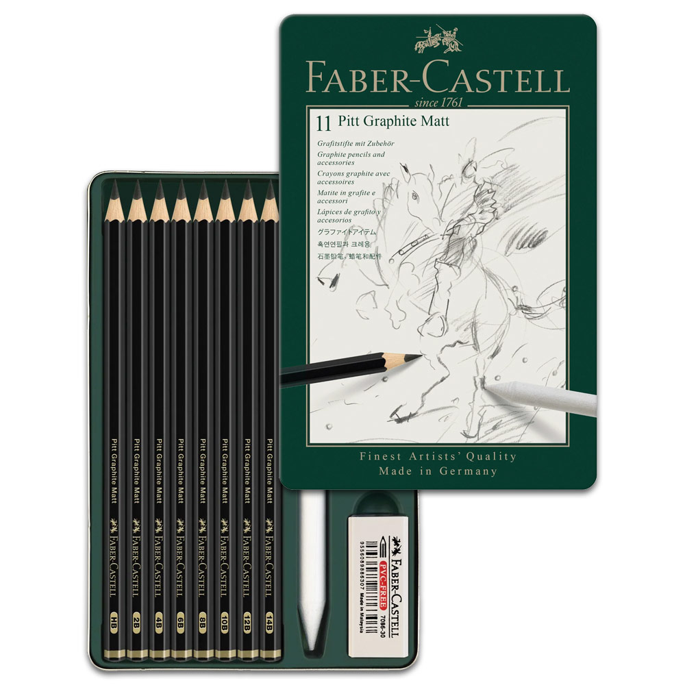

# Favorite
My First GItHub Repo &amp; GitHub Pages Site 

## My Favorite Art Supplies

##### I would consider myself to be a traditional artist, which is someone who works with physical mediums rather than digital. Through my years of practicing I've come across a lot of great and really bad art supplies. I'm here to recommend 3 of my umtilmate favorites and hopefully they'll become some of your favorites as well.

>***Remember the art supplies doesn't make you a better artist, practice is key!***

<ol>
  <li>Faber-Castell Pitt Graphite Matt Pencil</li>
  <li>Prismacolor Pencils</li>
  <li>Winsor & Newton Watercolors</li>
</ol>

Below the image I've added a link which reccomends more amazing art supplies!

[The best art supplies in 2023, from sketchbooks to pastels](https://www.businessinsider.com/guides/hobbies-crafts/best-art-supplies?utm_source=copy-link&utm_medium=referral&utm_content=topbar)
